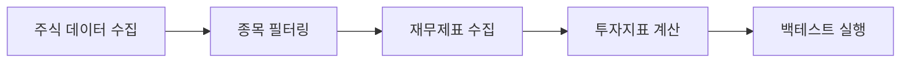

# Quantus Backend API

한국 주식 시장 데이터 분석 및 백테스트를 위한 FastAPI 기반 백엔드 시스템

## 📋 목차

- [프로젝트 개요](#-프로젝트-개요)
- [시작하기](#-시작하기)
- [투자전략수립](#-투자전략-수립)
- [API 문서](#-api-문서)
- [아키텍처](#-아키텍처)
- [도메인별 상세 설명](#-도메인별-상세-설명)
- [기술 스택](#-기술-스택)
- [환경 변수](#-환경-변수)

## 🎯 프로젝트 개요

### 주요 기능
- 📊 **주식 데이터 수집**: KRX API를 통한 실시간 주식 데이터 수집
- 🔍 **종목 필터링**: ETF, 우선주 등 다양한 조건의 종목 필터링
- 📈 **재무제표 분석**: DART API를 통한 기업 재무정보 수집 및 분석
- 📉 **투자지표 계산**: PER, PBR, ROE 등 핵심 투자지표 산출
- 🧪 **백테스트**: 월간 리밸런싱 기반 포트폴리오 성과 검증


## 🚀 시작하기
### 설치 및 실행

1. **저장소 클론**
    ```bash
    git clone https://github.com/kknaks/quantus-test.git
    cd quantus-test
    ```

2. **Dokcer-compose 실행**
    ```bash
    docker-compose up -d
    ```
    
3. **페이지 접속**
    ```bash
    http://localhost:3000/
    ```

## 💡 투자전략 수립
- [📊 데이터 분석 및 전략 상세 보고서](./report.ipynb)
### 📋 전략 수립 단계
#### Step 1: 종목 수집 및 필터링

- 데이터 수집: KRX API를 통한 KOSPI/KOSDAQ 전체 종목 수집
- 기본 필터링:
    > ETF 제거 (TIGER, KODEX 등)</br>
    > 인버스/레버리지 상품 제거</br>
    > 우선주, 전환사채 제거</br>
    > 관리종목, 투자주의환기종목 제거</br>
- 시가총액 구간 설정: 상위 40% ~ 하위 80% 구간 (중소형주 중심)

#### Step 2: 재무 데이터 수집 및 전처리

- 재무제표 수집: DART API를 통한 분기별 재무제표 수집
- 데이터 검증: 핵심 계정과목 0값 기업 제외
- 연간화 처리: 분기 데이터를 연간 기준으로 변환
- 공시일 매칭: 주가와 재무제표 공시일 동기화

#### Step 3: 투자지표 생성

- 일별 투자지표 계산: 주가 × 재무지표 결합
- 핵심 지표: PER, PBR, ROE, ROA, 영업이익률, 부채비율
- 시계열 데이터: 전체 백테스트 기간의 일별 지표 생성

#### Step 4: 투자지표 전처리 (극단값 제거, 통계 작성)

- 이상치 제거: IQR 방식 (Q1 - 1.5×IQR ~ Q3 + 1.5×IQR)
- 통계 계산: 분위수(Q1, Q3), 평균, 중간값 산출
- 투자구간 설정: 각 지표별 적정 투자 범위 도출

#### Step 5: 적정 투자지표 설정
- 투자지표 기준값 설정:
    > PER: lower_bound ~ mean (저평가 구간 선호)</br>
    > PBR: lower_bound ~ mean (저평가 구간 선호)</br>
    > ROE: median ~ upper_bound (고수익성 구간 선호)</br>
    > ROA: median ~ upper_bound (고수익성 구간 선호)</br>
    > 영업이익률: median ~ upper_bound (고수익성 구간 선호)</br>
    > 부채비율: 0 ~ q3 (안전성 구간 선호)</br>

### 🎯 종목 추출 로직 설계
#### 1단계: 기본 필터링
- 전체 종목 → 시가총액 구간 → 거래량 필터링 → 재무데이터 보유 종목

#### 2단계: 투자지표 스크리닝
- 투자지표 스크리닝 설정

    ```python
    def screening_criteria():
        return {
            'PER': [lower_bound, mean],
            'PBR': [lower_bound, mean], 
            'ROE': [mean, upper_bound],
            'ROA': [mean, upper_bound],
            '영업이익률': [mean, upper_bound],
            '부채비율': [0, q3]
        }
    ```

## 🧪 백테스트 로직 설계
#### 백테스트 파라미터

- 리밸런싱 주기: 매월 (월말 기준)
- 포트폴리오 규모: 10~20종목 (사용자 설정)
- 가중치 방식: 동일가중 (Equal Weight)
- 초기 자본: 1,000,000만원

#### 월간 리밸런싱 프로세스
- 프로세스 
    ```mermaid
    graph TD
        A[월말 리밸런싱 시점] --> B[해당월 재무지표 추출]
        B --> C[투자지표 기준 스크리닝]
        C --> D[팩터 스코어 계산]
        D --> E[상위 N개 종목 선택]
        E --> F[동일가중 포트폴리오 구성]
        F --> G[다음 월까지 수익률 계산]
        G --> H[다음 달로 이동]
        H --> A
    ```

#### 상세 백테스트 단계
1. 월별 데이터 준비
    ```python
    def get_monthly_fundamentals(date, data):
        # 해당 월의 가용한 최신 재무지표 추출
        # 공시일 기준으로 사용 가능한 데이터만 선택
        return fundamentals_data
    ```

2. 종목 스크리닝
    ```python
    def screen_stocks(fundamentals, criteria):
        selected = []
        for stock in fundamentals:
            if all_criteria_passed(stock, criteria):
                selected.append(stock)
        return selected
    ```

3. 팩터 스코어링 & 포트폴리오 구성
    ```python
    def build_portfolio(selected_stocks, top_n):
        # 팩터 스코어 계산
        scores = calculate_factor_scores(selected_stocks)
        # 상위 N개 선택
        top_stocks = scores.head(top_n)
        # 동일가중 포트폴리오
        weights = {stock: 1/top_n for stock in top_stocks}
        return weights
    ```

4. 수익률 계산
    ```python
    def calculate_monthly_return(portfolio, start_date, end_date):
        portfolio_return = 0
        for stock, weight in portfolio.items():
            stock_return = (end_price - start_price) / start_price
            portfolio_return += stock_return * weight
        return portfolio_return
    ```

#### 성과 분석 지표
- 수익률 지표:

    > 총 수익률: (최종자본 - 초기자본) / 초기자본 × 100 </br>
    > 연간 수익률: 총 수익률을 연환산 </br>
    > 월평균 수익률: 월별 수익률의 평균 </br>
    > 누적 수익률: 매월 누적된 수익률 </br>

- 리스크 지표:

    > 변동성: 월별 수익률의 표준편차 × √12 </br>
    > 샤프 비율: (연간수익률 - 무위험수익률) / 연간변동성</br>
    > 최대 낙폭: 고점 대비 최대 하락폭 </br>
    > 승률: 양의 수익률을 기록한 월의 비율 </br>


⚠️ 현재 구현 상태: 무위험 수익률은 3.5%(KOFR 평균)로 가정하여 계산


## 📖 API 문서
### API 문서 확인
- Swagger UI: http://localhost:8000/docs
- ReDoc: http://localhost:8000/redoc

### 주요 엔드포인트

#### 📊 주식 데이터 수집
```
POST /api/v1/collect/stocks
```
- KRX API를 통한 KOSPI/KOSDAQ 주식 데이터 수집
- 휴장일 자동 처리 및 다음 영업일 데이터 조회

#### 🔍 종목 필터링
```
POST /api/v1/filter/volumes          # 거래량 분석
POST /api/v1/filter/volumes/filter   # 거래량 필터링
POST /api/v1/filter/stocks/end       # 기간별 수익률 계산
POST /api/v1/filter/stocks/candidates # 투자 후보 선별
```

#### 📈 재무제표 조회
```
GET  /api/v1/financial/corp-code     # 기업 코드 조회
POST /api/v1/financial/statements    # 재무제표 조회
```

#### 📉 투자지표 생성
```
POST /api/v1/idx/gen-idx    # 투자지표 생성
POST /api/v1/idx/analysis   # 투자지표 분석
```

#### 🧪 백테스트
```
POST /api/v1/backtest/generate  # 백테스트 데이터 생성
POST /api/v1/backtest/start     # 백테스트 실행
```

## 🏗 아키텍처

```
backend/
├── app/
│   ├── api/
│   │   ├── routes/v1/          # API 라우터
│   │   └── main.py
│   ├── core/
│   │   └── config.py           # 환경 설정
│   ├── schemas/                # Pydantic 스키마
│   ├── service/                # 비즈니스 로직
│   └── main.py                 # FastAPI 앱 진입점
└── data/                       # 데이터 저장소
```

### 데이터 플로우


## 📋 도메인별 상세 설명

### 1. 📊 Stock Collector (주식 데이터 수집)
**파일**: `stock_collector.py`, `krx_api.py`


- **역할**: KRX API를 통한 KOSPI/KOSDAQ 주식 데이터 수집
- **주요 기능**:
  - 영업일 자동 처리 (휴장일 건너뛰기)
  - KOSPI/KOSDAQ 통합 데이터 수집


### 2. 🔍 Stock Filter (종목 필터링)
**파일**: `stock_filter.py`


- **역할**: 수집된 주식 데이터의 필터링 및 분석
- **주요 기능**:
  - ETF, 인버스, 우선주 등 불필요한 종목 제거
  - 거래량 기반 이상치 탐지 (IQR, 백분위수 방식)
  - 기간별 수익률 및 시가총액 변화율 계산
  - 투자 전략별 후보 종목 선별

**필터링 키워드**:
- ETF: TIGER, KODEX, HANARO 등
- 인버스/레버리지: 인버스, 레버리지, 선물 등
- 우선주: 우선주, 우B, 전환사채 등


### 3. 📈 Financial Statement (재무제표)
**파일**: `financial_statement.py`, `dart_api.py`


- **역할**: DART API를 통한 기업 재무정보 수집 및 처리
- **주요 기능**:
  - 분기별 재무제표 데이터 수집
  - 손익계산서, 재무상태표 파싱
  - 분기 데이터의 연간화 처리
  - 공시일 기준 데이터 매칭

**수집 재무 항목**:
- **손익계산서**: 매출액, 영업이익, 당기순이익 등
- **재무상태표**: 자산총계, 부채총계, 자본총계 등

### 4. 📉 Investment Index (투자지표)
**파일**: `invest_idx.py`


- **역할**: 주가와 재무제표를 결합한 투자지표 계산
- **주요 기능**:
  - 일별 주가 데이터와 분기별 재무제표 결합
  - 핵심 투자지표 시계열 생성
  - 투자구간 분석 및 이상치 제거

### 5. 🧪 Backtest (백테스트)
**파일**: `back_test.py`


- **역할**: 투자 전략의 성과 검증 및 리스크 분석
- **주요 기능**:
  - 월간 리밸런싱 기반 백테스트
  - 투자지표 기준 종목 스크리닝
  - 팩터 스코어 기반 포트폴리오 구성
  - 성과 및 리스크 지표 계산

**백테스트 프로세스**:
1. 테스트 데이터 생성 (선택 종목의 투자지표 시계열)
2. 월간 리밸런싱 (스크리닝 기준으로 종목 재선별)
3. 포트폴리오 구성 (팩터 스코어 기반 상위 N개 종목)
4. 수익률 계산 (월간 수익률 및 누적 수익률)
5. 리스크 분석 (변동성, 샤프비율, 최대낙폭, 승률)

**팩터 스코어링**:
- **Value 점수**: (1/PER + 1/PBR) × 50
- **Quality 점수**: (ROE + ROA + 영업이익률) 평균
- **Momentum 점수**: ROE 기준
- **종합 점수**: Value(40%) + Quality(50%) + Momentum(10%)

## 🛠 기술 스택

- **Framework**: FastAPI
- **Language**: Python 3.8+
- **Data Processing**: Pandas, NumPy
- **API Integration**: KRX API, DART API
- **Validation**: Pydantic
- **Concurrency**: ThreadPoolExecutor
- **HTTP Client**: Requests


## ⚙️ 환경 변수

`.env` 파일에서 다음 변수들을 설정해야 합니다:

```env
# 프로젝트 설정
PROJECT_NAME=Quantus
ENVIRONMENT=local
FRONTEND_HOST=http://localhost:3000

# KRX API 설정
KRX_API_KEY=your_krx_api_key
KRX_API_URL=https://data-dbg.krx.co.kr/svc/apis

# DART API 설정  
DART_API_KEY=your_dart_api_key
DART_API_URL=https://opendart.fss.or.kr/api

# CORS 설정
BACKEND_CORS_ORIGINS=["http://localhost:3000"]
```


